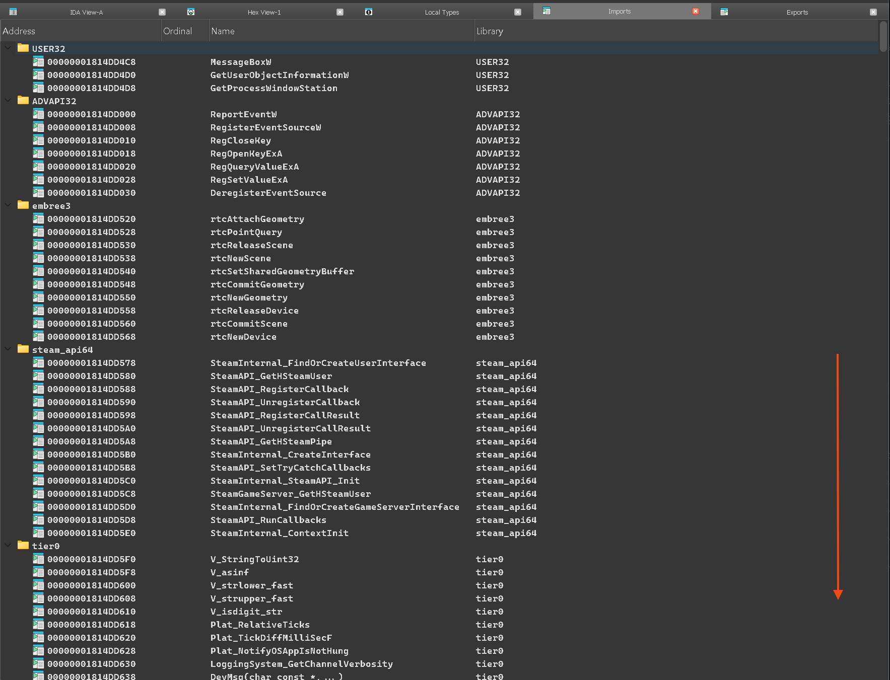
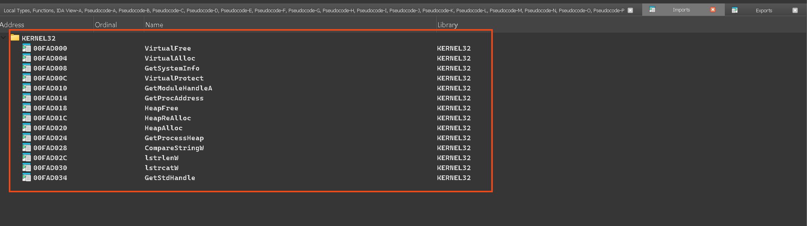
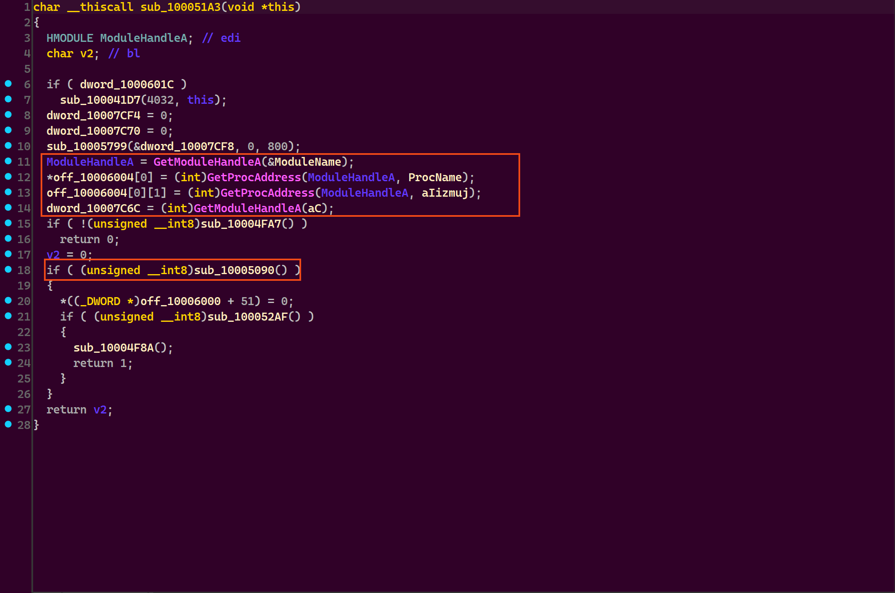
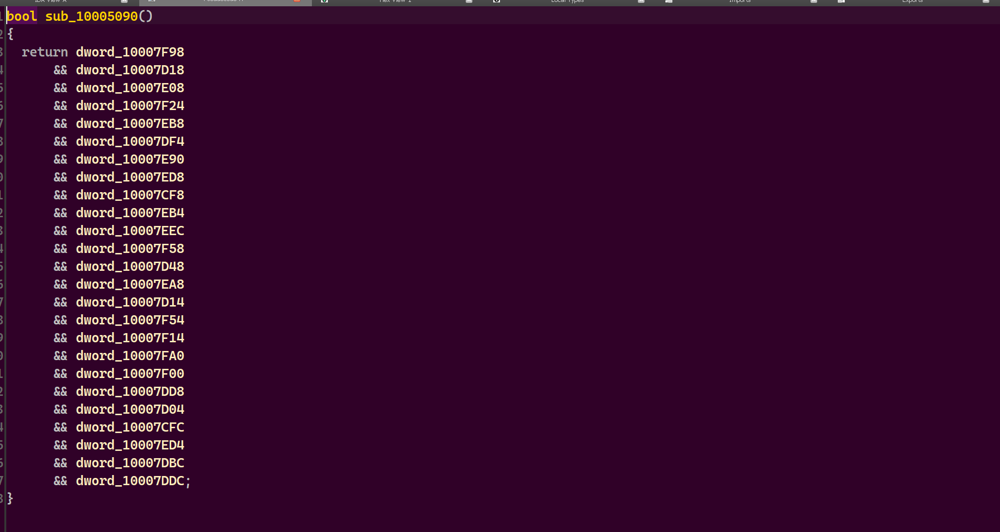
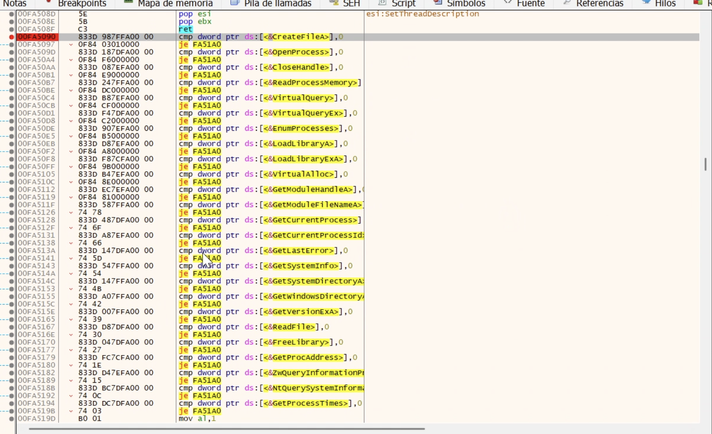
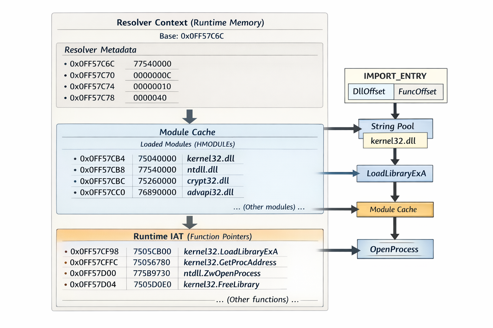
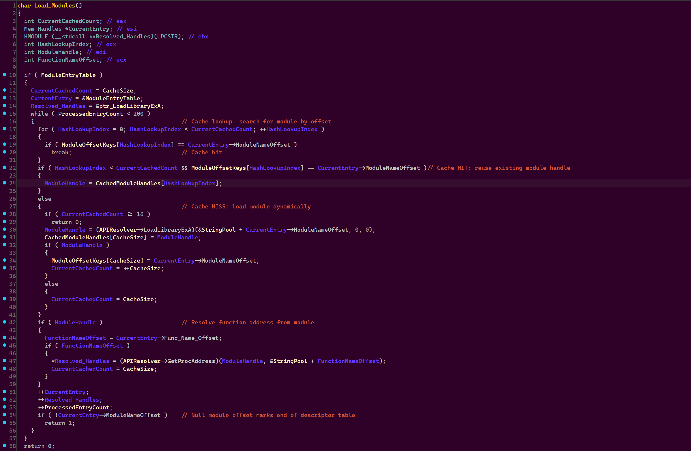
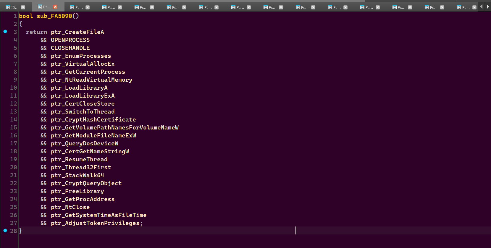

# Hunting the Invisible - Reverse Engineering Dynamic Import Resolution

 

## Context and Relevance
This repository documents a **dynamic import resolution technique used by Valve Anti-Cheat (VAC)** in several runtime modules distributed to users. While the specific modules analyzed here are no longer actively enforced, the technique itself remains relevant and is preserved for technical documentation and reverse engineering reference.

--- 
Imagine you are analyzing a suspicious executable, intent on uncovering its true nature. You open it in your preferred disassembler, expecting to find the usual clues, but immediately something feels *off*. Not just a little off, profoundly off. The Import Address Table (IAT), a fundamental structure in Windows executables that declares all external API dependencies, is almost **empty**. According to the Portable Executable (PE) headers, this program barely imports anything at all. There are no obvious calls to memory allocation functions, no thread creation routines, and no evidence of suspicious behavior on paper. 

Yet, this stark emptiness stands in sharp contrast to the binary’s observed behavior. Below, we present **two binaries opened in IDA**, displayed exactly as static analysis reveals them. The first is a **typical binary**, with a large and explicit Import Address Table clearly outlining its external dependencies:

<p align="center">
  
</p>

Directly beneath it, a second binary appears, **similar in functionality but radically different in form**:

<p align="center">
  
</p>

This second executable imports only a minimal subset of `KERNEL32` functions, just enough to bootstrap execution, while masterfully concealing its true dependencies. And yet, when executed, it performs **everything** one would expect: memory allocation, thread creation, process inspection, the full operational spectrum unfolds seamlessly.

**How is this possible?**

The answer lies in the fact that the real imports are never declared in the PE file itself. Instead, they are resolved **dynamically at runtime**, and stored in a custom, in-memory **Import Address Table**. This sophisticated technique effectively renders the import table invisible to static analysis, only to reconstruct it on-the-fly during execution.

Welcome to the intricate realm of **dynamic IAT resolution**.

---
## Initial Analysis: Static Inspection and Its Limits

At this juncture, static analysis has already sounded a clear alarm: the Import Address Table is far too sparse to account for the binary’s actual behavior. To uncover the truth lurking beneath this deceptive surface, one must follow the execution path dynamically, observing how the program evolves in memory.

### Stage 1: Bootstrap Phase and Minimal Resolver Setup

Every **dynamic import resolver** hinges on a critical **bootstrap phase**, a brief but essential execution window whereby just enough functionality is provisioned to assemble the entire import infrastructure. This phase is not about performing substantive work yet; rather, it is about **silently laying the groundwork**, meticulously preparing the environment without revealing any explicit intent.

In this particular binary, the bootstrap logic is deliberately concealed within what initially appears to be an ordinary initialization routine. Near the program’s entry point, we encounter a function executing a handful of **seemingly mundane operations**: retrieving a few module handles, resolving a couple of function pointers, clearing memory regions, and conducting a series of checks. 

At first glance, **nothing about this code arouses suspicion**.

The screenshots below capture this function as observed through static analysis. The control flow is linear and straightforward, API usage minimal, and there is no clear indication that a comprehensive import resolution mechanism is being constructed beneath the surface.

<p align="center">
  
</p>

<p align="center">
  
</p>

At this stage, static analysis has reached its **practical limit**. The PE’s Import Address Table is intentionally sparse, and the binary contains **no readable API strings** that might explain its behavior. On disk, there simply isn’t enough information to justify what the binary will ultimately accomplish at runtime.

The only viable path forward is to **trace execution dynamically**, watching as the program unfolds its true nature.

When observed at runtime, the picture transforms dramatically. The very same subroutine that previously performed innocuous checks is now fully populated with **valid pointers to imported functions**, confirming that the **bootstrap phase** has completed successfully and the resolver infrastructure is firmly in place.

<p align="center">
  
</p>

---

### Stage 2: Runtime Reconstruction of Imports

To better understand the complex memory layout constructed by the resolver, consider the following diagram. This image serves as a mental model, illustrating how the binary organizes its internal structures to achieve **runtime reconstruction** of imports. The diagram clearly maps to the memory dump structures: starting with **resolver metadata** at the top, followed by the **module cache**, and culminating in the fully realized **runtime Import Address Table** at the bottom.

<p align="center">
  
</p>

As execution proceeds, the illusion of emptiness **gradually dissolves**. What initially appeared to be a complete lack of imports is revealed not as simplicity, but as deliberate deferral. Instead of declaring dependencies statically within the PE file, the binary defers all import resolution until runtime, reconstructing everything dynamically in memory.

The first concrete evidence of this dynamic reconstruction appears immediately after the bootstrap phase concludes. Dumping the relevant memory region reveals a block of data that is neither executable code nor a standard PE structure, yet is clearly organized and purposeful.

At the start of this memory region, we find what appears to be **resolver state and metadata**:

```cpp
0FF57C6C  77540000  ntdll
0FF57C70  0000000C
0FF57C74  00000010
0FF57C78  00000040
0FF57C7C  00000158
…
```

These values do not correspond to API pointers or executable addresses. Instead, they serve as internal counters, offsets, and size limits that coordinate the resolution process. This is the resolver’s bookkeeping layer,  invisible at the PE level, yet absolutely essential for managing the complex structures that follow.

A short distance below, the memory dump reveals a compact and unmistakable structure: a list of module base addresses.

```cpp
0FF57CB4  75040000  kernel32
0FF57CB8  77540000  ntdll
0FF57CBC  75260000  crypt32
0FF57CC0  76B90000  advapi32
0FF57CC4  72CD0000  version
0FF57CC8  75A30000  psapi
0FF57CCC  76DD0000  wintrust
0FF57CD0  75A40000  setupapi
0FF57CD4  70AE0000  secur32
0FF57CD8  74BF0000  iphlpapi
0FF57CDC  67D10000  dbghelp
```

Each entry is a valid `HMODULE`, corresponding to a DLL manually loaded by the resolver. This is not the operating system’s import table. Instead, it is a custom **runtime module cache**, populated on demand using `LoadLibraryExA`.

Further down, the most revealing structure finally emerges: a long, contiguous sequence of function pointers, each resolved to its final address:

```cpp
0FF57CF8  7505CB00  kernel32.LoadLibraryExA
0FF57CFC  75056780  kernel32.GetProcAddress
0FF57D00  775B9730  ntdll.ZwOpenProcess
0FF57D04  7505D0E0  kernel32.FreeLibrary
0FF57D08  7505ED00  kernel32.GetVolumeInformationW
0FF57D0C  750700B0  kernel32.GetFileInformationByHandleEx
0FF57D10  750712C0  kernel32.QueryFullProcessImageNameW
0FF57D14  75063330  kernel32.GetLastError
0FF57D18  7505B410  kernel32.OpenProcess
…
```

This is the moment when the illusion fully collapses.

What we observe is a complete, fully functional **Import Address Table**, constructed entirely at runtime. Every entry corresponds to a genuine Windows API function, resolved via `GetProcAddress` and stored in a predictable, indexable layout. The table spans well over a hundred entries, covering a broad range of critical functionality: process management, memory operations, cryptography, service control, native NT calls, and debugging capabilities.

None of these pointers appear in the PE import directory.  
None are visible to any static analysis tools.

Yet from this point onward, the binary treats this custom table exactly as it would a normal IAT, indexing into it and invoking APIs directly, with no further resolution overhead or indirection.

---

### Stage 3: Module Resolution and Caching Logic

Once the string pool is established, the resolver iterates over the import descriptor table and resolves each entry.

Before presenting the conceptual C++ resolver, it's helpful to see how the same logic appears in IDA's pseudocode output. The following fragment reflects the real structure as seen in IDA, with symbols renamed for clarity. It illustrates the linear cache lookup, conditional module loading, and function address resolution:

```c
// IDA-style pseudocode (simplified)
for ( i = 0; i < CacheSize; ++i )
{
  if ( ModuleOffsetKeys[i] == entry->ModuleNameOffset )
  {
    hModule = CachedModuleHandles[i];
    goto RESOLVE_FUNCTION;
  }
}

hModule = LoadLibraryExA(stringPool + entry->ModuleNameOffset, 0, 0);
CachedModuleHandles[CacheSize] = hModule;
ModuleOffsetKeys[CacheSize++] = entry->ModuleNameOffset;

RESOLVE_FUNCTION:
pFunc = GetProcAddress(hModule, stringPool + entry->Func_Name_Offset);
```

To avoid repeated `LoadLibraryExA` calls, the binary maintains a small **module cache** implemented as parallel arrays:

```cpp
uint32_t ModuleOffsetKeys[16];
HMODULE  CachedModuleHandles[16];
uint32_t CacheSize;
```

Conceptually, the resolution logic is:

```cpp
for (int i = 0; i < CacheSize; i++) {
    if (ModuleOffsetKeys[i] == entry->ModuleNameOffset)
        return CachedModuleHandles[i];
}

HMODULE hMod = LoadLibraryExA(string_pool + entry->ModuleNameOffset, 0, 0);
CachedModuleHandles[CacheSize] = hMod;
ModuleOffsetKeys[CacheSize++] = entry->ModuleNameOffset;
```

This is effectively a linear cache-based lookup, a “poor man’s hash map” optimized for a small, fixed number of modules.

Full IDA View (Resolver Implementation)  
For completeness, below is the resolver logic exactly as recovered from IDA:

<p align="center">
  
</p>

```cpp
// Simplified conceptual model of the dynamic module resolver.
// This code models the logic of resolving module handles and caching them,
// enabling efficient repeated lookups without redundant LoadLibraryExA calls.

struct ImportEntry {
    uint32_t moduleNameOffset;   // Offset into the runtime string pool for module name
    uint32_t functionNameOffset; // Offset into the runtime string pool for function name
};

static const int MAX_MODULES = 16;

// Runtime resolver state: small cache of loaded modules
uint32_t cachedModuleOffsets[MAX_MODULES];  // Stores module name offsets as keys
HMODULE  cachedModuleHandles[MAX_MODULES];  // Corresponding loaded module handles
int      cacheSize = 0;                      // Current number of cached modules

// Attempt to resolve a module handle using the cache first
HMODULE resolveModule(const char* stringPool, uint32_t moduleOffset) {
    // Linear search through cache (matches the cache lookup loop seen in IDA)
    for (int i = 0; i < cacheSize; ++i) {
        if (cachedModuleOffsets[i] == moduleOffset) {
            return cachedModuleHandles[i]; // Cache hit: corresponds to early return/goto in IDA
        }
    }

    // Cache miss: load the module dynamically (matches LoadLibraryExA call in IDA pseudocode)
    if (cacheSize >= MAX_MODULES)
        return nullptr; // Cache full, cannot load more modules

    const char* moduleName = stringPool + moduleOffset;
    HMODULE hModule = LoadLibraryExA(moduleName, nullptr, 0);

    if (hModule) {
        // Store new module handle in cache for future reuse (maps to array updates in IDA)
        cachedModuleOffsets[cacheSize] = moduleOffset;
        cachedModuleHandles[cacheSize] = hModule;
        ++cacheSize;
    }

    return hModule;
}

// Resolve all imports by iterating over the import table,
// loading modules and retrieving function addresses dynamically.
void resolveImports(const char* stringPool,
                    const ImportEntry* importTable,
                    FARPROC* resolvedIAT)
{
    for (int i = 0; importTable[i].moduleNameOffset != 0; ++i) {
        const ImportEntry& entry = importTable[i];

        HMODULE hModule = resolveModule(stringPool, entry.moduleNameOffset);
        if (!hModule)
            continue; // Skip unresolved modules

        // Function address resolution (matches GetProcAddress after module handle in IDA)
        const char* functionName = stringPool + entry.functionNameOffset;
        resolvedIAT[i] = GetProcAddress(hModule, functionName);
    }
}
```

---

## Runtime Validation: Confirming the Reconstructed IAT in Memory

This memory region is the **real Import Address Table**, not the one declared in the PE file, but a custom IAT constructed entirely at runtime.  
It is **invisible to static analysis** and only becomes evident once the binary is executed.

After resolving and renaming all entries using the Python script below, the following validation logic finally makes sense: the binary explicitly checks that every required API pointer has been correctly resolved before continuing execution.

This validation step confirms that the runtime IAT has been fully reconstructed before execution proceeds. In IDA, the check may appear as:

```c
// IDA-style validation check
if ( ptr_CreateFileA &&
     ptr_OpenProcess &&
     ptr_ReadProcessMemory &&
     ptr_VirtualAllocEx &&
     ptr_NtReadVirtualMemory )
{
    proceed_execution();
}
```

Below are two views of this validation function: first, in **IDA**, where the runtime IAT entries have been properly renamed for clarity:

<p align="center">
  
</p>

And second, the **same region observed live in x64dbg**, confirming that the resolved pointers in memory match exactly what IDA now shows symbolically:

![[images/x64dbg_Check.png]]

At this point, there is no ambiguity left.  
The binary does not rely on the PE import table at all, it builds, validates, and exclusively uses its own **runtime-resolved IAT**. This definitive evidence closes the case: the import table has been rendered invisible to static analysis and fully reconstructed at runtime, a technique that elegantly defeats traditional reverse engineering methods.

---
## Annotating Runtime-Reconstructed Import Strings in IDA Pro

The following Python script is designed to be run inside IDA Pro after loading the binary. Its purpose is to assign meaningful names to memory addresses containing dynamically reconstructed import-related strings (DLL names and API names). These strings do *not* exist in the PE file on disk; they are rebuilt at runtime and referenced via offsets by the dynamic import resolver.

By running this script, reverse engineers can improve the readability of the disassembly by labeling these strings, aiding in further analysis and understanding of the import resolution logic.

```python
# -----------------------------------------------------------------------------
# IDA Pro Script: Annotate Runtime-Reconstructed Import Strings
# -----------------------------------------------------------------------------
# Purpose:
#   Assigns meaningful names to memory addresses containing dynamically
#   reconstructed import-related strings (DLL names and API names).
#
#   These strings do NOT exist in the PE file on disk. They are rebuilt at
#   runtime and referenced via offsets by the dynamic import resolver.
#
# Usage:
#   - Adjust the 'imports' dictionary if necessary to match your binary.
#   - Run this script inside IDA after loading the binary.
#   - The script will label each address accordingly, improving analysis.
#
# Tested on:
#   - IDA Pro 9.1.250226
# -----------------------------------------------------------------------------

import ida_name

# Runtime string pool:
# Mapping of memory address to string value representing DLL or API names.
imports = {
    0x0F796020: "kernel32.dll",
    0x0F796030: "LoadLibraryExA",
    0x0F796040: "GetProcAddress",
    0x0F796050: "ntdll.dll",
    0x0F796060: "NtOpenProcess",
    0x0F796070: "FreeLibrary",
    0x0F796080: "NtWow64QueryVirtualMemory64",
    # ... (rest of the entries unchanged)
    0x0F796F90: "VirtualProtect",
}

renamed = 0
failed = 0

print("[*] Annotating runtime import string pool...")

for address, string_value in imports.items():

    # Normalize the name so it is valid inside IDA labels
    sanitized_name = string_value.replace(".", "_").replace(" ", "_")

    # Use distinct prefixes to differentiate DLL names from API function names
    if string_value.lower().endswith(".dll"):
        ida_label = f"str_{sanitized_name}"
    else:
        ida_label = f"api_{sanitized_name}"

    try:
        # Attempt to assign the name in IDA
        if ida_name.set_ea_name(address, ida_label):
            print(f"[+] {hex(address)} -> {ida_label}")
            renamed += 1
        else:
            print(f"[-] Failed to rename {hex(address)}")
            failed += 1

    except Exception as e:
        print(f"[!] Error at {hex(address)}: {e}")
        failed += 1

print("\n[*] Summary")
print(f"    Renamed successfully : {renamed}")
print(f"    Failed / skipped     : {failed}")
print("[*] Done.")
```