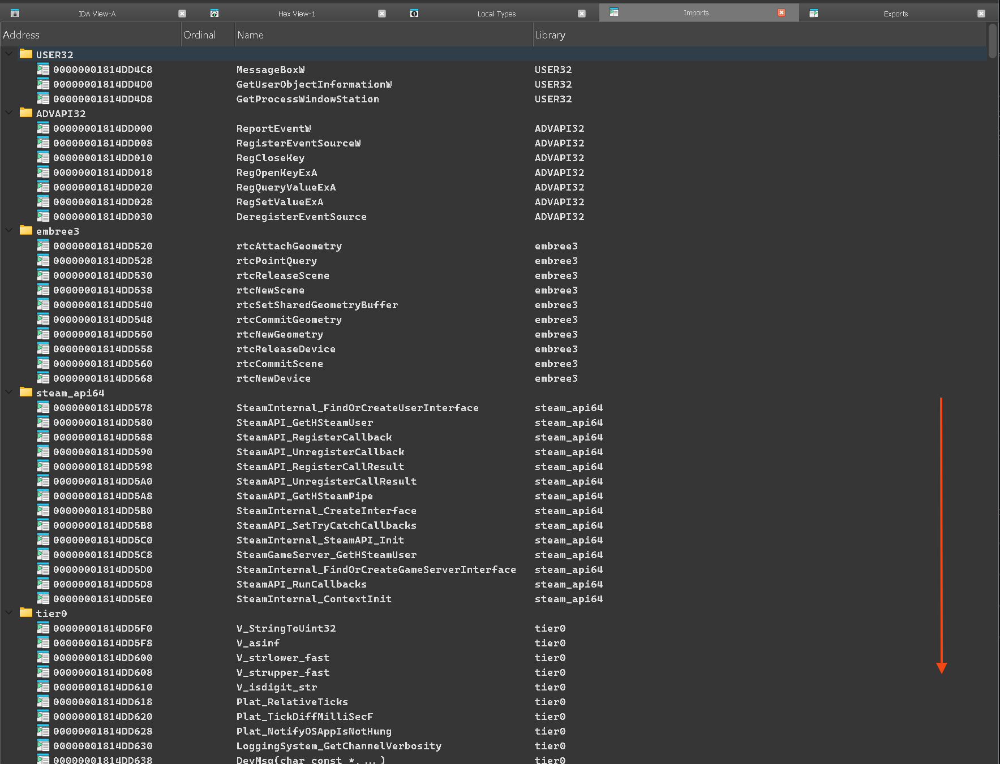
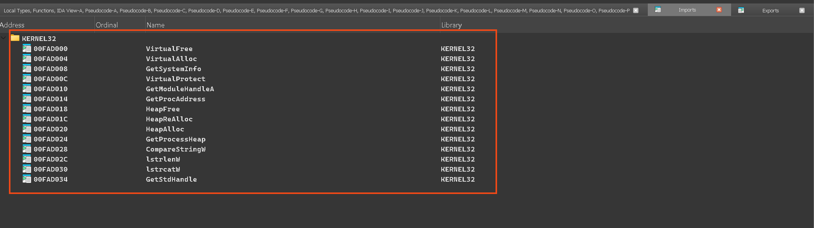
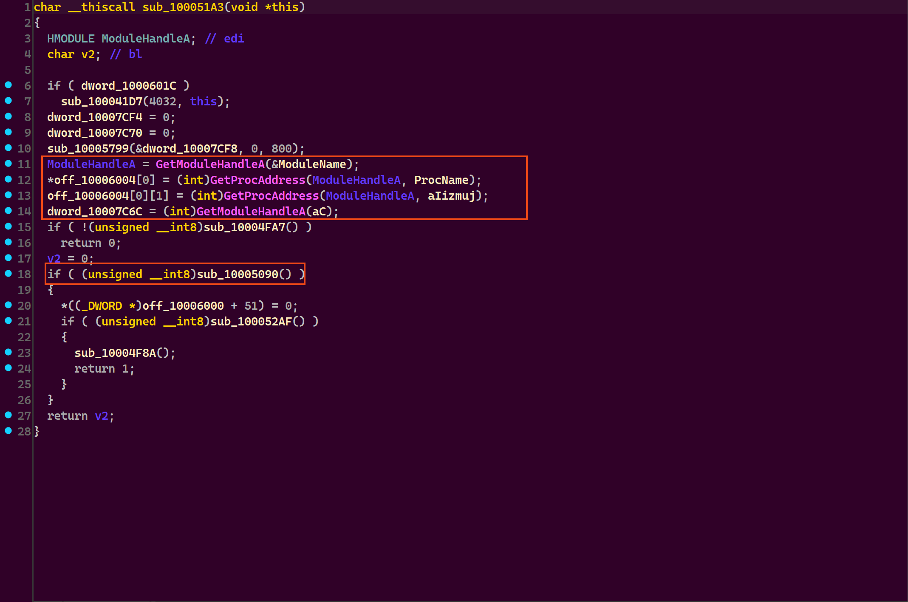
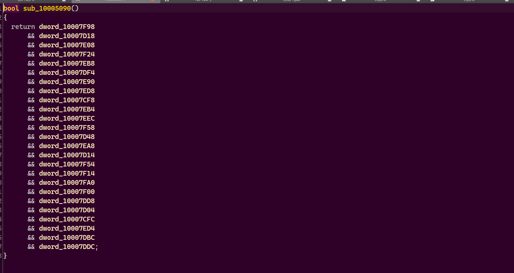
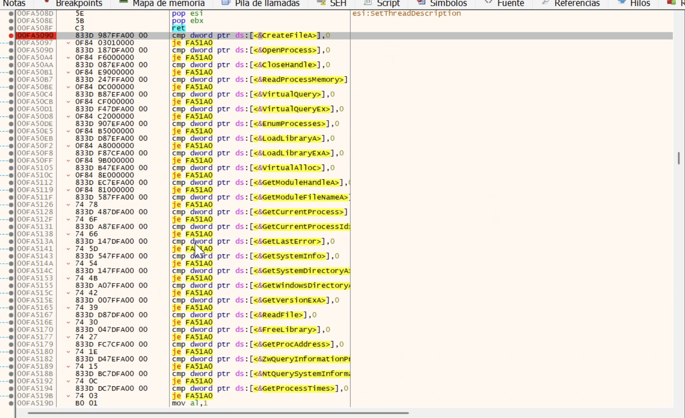
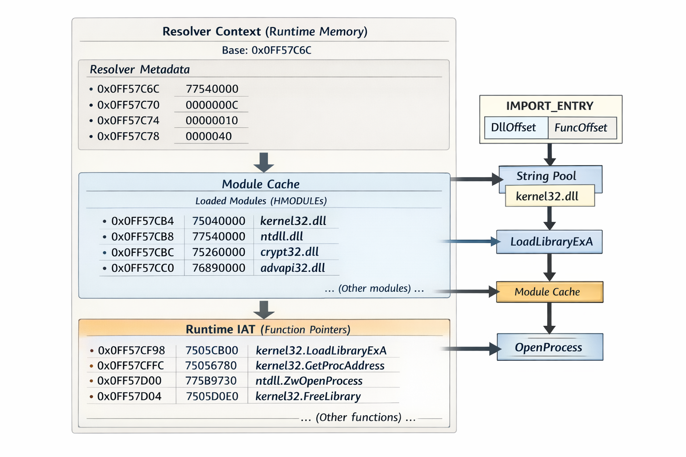
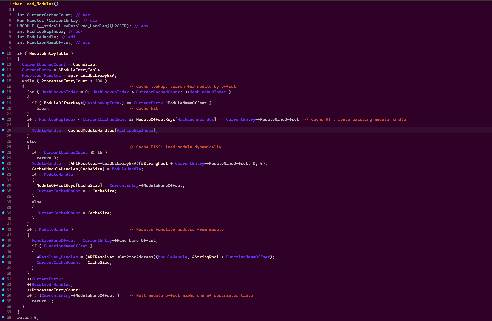
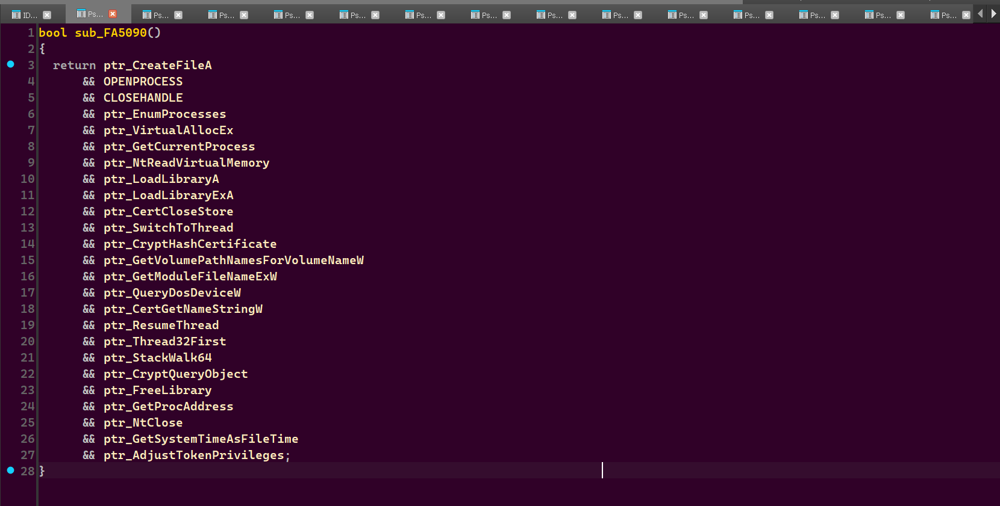

# Reverse Engineering Runtime Import Resolution in Practice

 

## Context and Relevance
This repository documents a **classic Windows runtime import resolution technique** observed in a real-world module.

The mechanism itself is neither new nor unusual in Windows internals: dynamically resolving APIs instead of relying on the static Import Address Table has been used for decades in packers, protectors, anti-cheat systems and malware.  

However, for analysts coming from environments such as Android, where symbols, JNI boundaries and framework APIs provide early semantic context, encountering a nearly empty Import Address Table can make the program initially appear inert during static analysis.

The goal of this write-up is therefore not to introduce a novel method, but to **walk through a practical example and show how to recognize and reason about it during reverse engineering**.

--- 

When analyzing Windows binaries, a sparse Import Address Table is often an intentional design choice rather than an anomaly.

In this case, the executable imports almost no high-level APIs according to the PE headers.  
Statically, the program appears to lack memory allocation, thread creation, or process interaction capabilities.

Yet during execution, the binary performs all of these operations normally.

This apparent contradiction is a well-known consequence of **runtime API resolution**: the program does not declare its dependencies in the PE file, but reconstructs them dynamically in memory and uses the resulting table as its effective Import Address Table.

This contrasts with the behavior observed during execution. Below, we present **two binaries opened in IDA**, displayed exactly as static analysis reveals them. The first is a **typical binary**, with a large and explicit Import Address Table clearly outlining its external dependencies:

<p align="center">
  
</p>

Directly beneath it, a second binary appears, **similar in functionality but radically different in form**:

<p align="center">
  
</p>

This second executable imports only a minimal subset of `KERNEL32` functions, just enough to bootstrap execution, while not declaring its dependencies in the PE headers. And yet, when executed, it performs **everything** one would expect: memory allocation, thread creation, process inspection, the full operational spectrum unfolds seamlessly.

This behavior is expected when a binary reconstructs its imports at runtime.

This behavior is commonly referred to as runtime IAT resolution.

---
## Initial Analysis: Static Inspection and Its Limits

At this point, the Import Address Table is too sparse to explain the observed behavior. Runtime tracing is required to understand how the program operates.

### Stage 1: Bootstrap Phase and Minimal Resolver Setup

As with most runtime resolvers, execution begins with a small bootstrap routine whose purpose is to obtain the minimal functionality required to initialize the resolver.

In this particular binary, the bootstrap logic is deliberately concealed within what initially appears to be an ordinary initialization routine. Near the program’s entry point, we encounter a function executing a handful of **seemingly mundane operations**: retrieving a few module handles, resolving a couple of function pointers, clearing memory regions, and conducting a series of checks. 

Statically, the routine appears ordinary because it performs only a few initialization steps.

The screenshots below capture this function as observed through static analysis. The control flow is linear and straightforward, API usage minimal, and there is no clear indication that a comprehensive import resolution mechanism is being constructed beneath the surface.

<p align="center">
  
</p>

<p align="center">
  
</p>

At this stage, static analysis has reached its **practical limit**. The PE’s Import Address Table is intentionally sparse, and the binary contains **no readable API strings** that might explain its behavior. On disk, there simply isn’t enough information to justify what the binary will ultimately accomplish at runtime.

At this stage, runtime tracing is required to understand the behavior.

When observed at runtime, the behavior becomes clear. The very same subroutine that previously performed innocuous checks is now fully populated with **valid pointers to imported functions**, confirming that the **bootstrap phase** has completed successfully and the resolver infrastructure is firmly in place.

<p align="center">
  
</p>

---

### Stage 2: Runtime Reconstruction of Imports

To better understand the complex memory layout constructed by the resolver, consider the following diagram. This image serves as a mental model, illustrating how the binary organizes its internal structures to achieve **runtime reconstruction** of imports. The diagram clearly maps to the memory dump structures: starting with **resolver metadata** at the top, followed by the **module cache**, and culminating in the fully realized **runtime Import Address Table** at the bottom.

<p align="center">
  
</p>

Once the bootstrap phase completes, memory inspection shows the expected resolver structures appearing in process memory. The binary progressively constructs an internal table containing module handles and function pointers.

The first concrete evidence of this dynamic reconstruction appears immediately after the bootstrap phase concludes. Dumping the relevant memory region reveals a block of data that is neither executable code nor a standard PE structure, yet is clearly organized and purposeful.

At the start of this memory region, we find what appears to be **resolver state and metadata**:

```cpp
0FF57C6C  77540000  ntdll
0FF57C70  0000000C
0FF57C74  00000010
0FF57C78  00000040
0FF57C7C  00000158
…
```

These values do not correspond to API pointers or executable addresses. Instead, they serve as internal counters, offsets, and size limits that coordinate the resolution process. This is the resolver’s bookkeeping layer,  invisible at the PE level, yet absolutely essential for managing the complex structures that follow.

A short distance below, the memory dump reveals a compact and unmistakable structure: a list of module base addresses.

```cpp
0FF57CB4  75040000  kernel32
0FF57CB8  77540000  ntdll
0FF57CBC  75260000  crypt32
0FF57CC0  76B90000  advapi32
0FF57CC4  72CD0000  version
0FF57CC8  75A30000  psapi
0FF57CCC  76DD0000  wintrust
0FF57CD0  75A40000  setupapi
0FF57CD4  70AE0000  secur32
0FF57CD8  74BF0000  iphlpapi
0FF57CDC  67D10000  dbghelp
```

Each entry is a valid `HMODULE`, corresponding to a DLL manually loaded by the resolver. This is not the operating system’s import table. Instead, it is a custom **runtime module cache**, populated on demand using `LoadLibraryExA`.

Further down, the most revealing structure finally emerges: a long, contiguous sequence of function pointers, each resolved to its final address:

```cpp
0FF57CF8  7505CB00  kernel32.LoadLibraryExA
0FF57CFC  75056780  kernel32.GetProcAddress
0FF57D00  775B9730  ntdll.ZwOpenProcess
0FF57D04  7505D0E0  kernel32.FreeLibrary
0FF57D08  7505ED00  kernel32.GetVolumeInformationW
0FF57D0C  750700B0  kernel32.GetFileInformationByHandleEx
0FF57D10  750712C0  kernel32.QueryFullProcessImageNameW
0FF57D14  75063330  kernel32.GetLastError
0FF57D18  7505B410  kernel32.OpenProcess
…
```

At this point the structure becomes clear.

What we observe is a complete, fully functional **Import Address Table**, constructed entirely at runtime. Every entry corresponds to a genuine Windows API function, resolved via `GetProcAddress` and stored in a predictable, indexable layout. The table spans well over a hundred entries, covering a broad range of critical functionality: process management, memory operations, cryptography, service control, native NT calls, and debugging capabilities.

These pointers do not appear in the PE import directory and therefore are not visible during initial static inspection.

Yet from this point onward, the binary treats this custom table exactly as it would a normal IAT, indexing into it and invoking APIs directly, with no further resolution overhead or indirection.

---

### Stage 3: Module Resolution and Caching Logic

Once the string pool is established, the resolver iterates over the import descriptor table and resolves each entry.

Before presenting the conceptual C++ resolver, it's helpful to see how the same logic appears in IDA's pseudocode output. The following fragment reflects the real structure as seen in IDA, with symbols renamed for clarity. It illustrates the linear cache lookup, conditional module loading, and function address resolution:

```c
// IDA-style pseudocode (simplified)
for ( i = 0; i < CacheSize; ++i )
{
  if ( ModuleOffsetKeys[i] == entry->ModuleNameOffset )
  {
    hModule = CachedModuleHandles[i];
    goto RESOLVE_FUNCTION;
  }
}

hModule = LoadLibraryExA(stringPool + entry->ModuleNameOffset, 0, 0);
CachedModuleHandles[CacheSize] = hModule;
ModuleOffsetKeys[CacheSize++] = entry->ModuleNameOffset;

RESOLVE_FUNCTION:
pFunc = GetProcAddress(hModule, stringPool + entry->Func_Name_Offset);
```

To avoid repeated `LoadLibraryExA` calls, the binary maintains a small **module cache** implemented as parallel arrays:

```cpp
uint32_t ModuleOffsetKeys[16];
HMODULE  CachedModuleHandles[16];
uint32_t CacheSize;
```

Conceptually, the resolution logic is:

```cpp
for (int i = 0; i < CacheSize; i++) {
    if (ModuleOffsetKeys[i] == entry->ModuleNameOffset)
        return CachedModuleHandles[i];
}

HMODULE hMod = LoadLibraryExA(string_pool + entry->ModuleNameOffset, 0, 0);
CachedModuleHandles[CacheSize] = hMod;
ModuleOffsetKeys[CacheSize++] = entry->ModuleNameOffset;
```

This is effectively a linear cache-based lookup, a “poor man’s hash map” optimized for a small, fixed number of modules.

Full IDA View (Resolver Implementation)  
For completeness, below is the resolver logic exactly as recovered from IDA:

<p align="center">
  
</p>

```cpp
// Simplified conceptual model of the dynamic module resolver.
// This code models the logic of resolving module handles and caching them,
// enabling efficient repeated lookups without redundant LoadLibraryExA calls.

struct ImportEntry {
    uint32_t moduleNameOffset;   // Offset into the runtime string pool for module name
    uint32_t functionNameOffset; // Offset into the runtime string pool for function name
};

static const int MAX_MODULES = 16;

// Runtime resolver state: small cache of loaded modules
uint32_t cachedModuleOffsets[MAX_MODULES];  // Stores module name offsets as keys
HMODULE  cachedModuleHandles[MAX_MODULES];  // Corresponding loaded module handles
int      cacheSize = 0;                      // Current number of cached modules

// Attempt to resolve a module handle using the cache first
HMODULE resolveModule(const char* stringPool, uint32_t moduleOffset) {
    // Linear search through cache (matches the cache lookup loop seen in IDA)
    for (int i = 0; i < cacheSize; ++i) {
        if (cachedModuleOffsets[i] == moduleOffset) {
            return cachedModuleHandles[i]; // Cache hit: corresponds to early return/goto in IDA
        }
    }

    // Cache miss: load the module dynamically (matches LoadLibraryExA call in IDA pseudocode)
    if (cacheSize >= MAX_MODULES)
        return nullptr; // Cache full, cannot load more modules

    const char* moduleName = stringPool + moduleOffset;
    HMODULE hModule = LoadLibraryExA(moduleName, nullptr, 0);

    if (hModule) {
        // Store new module handle in cache for future reuse (maps to array updates in IDA)
        cachedModuleOffsets[cacheSize] = moduleOffset;
        cachedModuleHandles[cacheSize] = hModule;
        ++cacheSize;
    }

    return hModule;
}

// Resolve all imports by iterating over the import table,
// loading modules and retrieving function addresses dynamically.
void resolveImports(const char* stringPool,
                    const ImportEntry* importTable,
                    FARPROC* resolvedIAT)
{
    for (int i = 0; importTable[i].moduleNameOffset != 0; ++i) {
        const ImportEntry& entry = importTable[i];

        HMODULE hModule = resolveModule(stringPool, entry.moduleNameOffset);
        if (!hModule)
            continue; // Skip unresolved modules

        // Function address resolution (matches GetProcAddress after module handle in IDA)
        const char* functionName = stringPool + entry.functionNameOffset;
        resolvedIAT[i] = GetProcAddress(hModule, functionName);
    }
}
```

---

## Runtime Validation: Confirming the Reconstructed IAT in Memory

This memory region is the **real Import Address Table**, not the one declared in the PE file, but a custom IAT constructed entirely at runtime.  
It is **invisible to static analysis** and only becomes evident once the binary is executed.

After resolving and renaming all entries using the Python script below, the following validation logic finally makes sense: the binary explicitly checks that every required API pointer has been correctly resolved before continuing execution.

This validation step confirms that the runtime IAT has been fully reconstructed before execution proceeds. In IDA, the check may appear as:

```c
// IDA-style validation check
if ( ptr_CreateFileA &&
     ptr_OpenProcess &&
     ptr_ReadProcessMemory &&
     ptr_VirtualAllocEx &&
     ptr_NtReadVirtualMemory )
{
    proceed_execution();
}
```

Below are two views of this validation function: first, in **IDA**, where the runtime IAT entries have been properly renamed for clarity:

<p align="center">
  
</p>

And second, the **same region observed live in x64dbg**, confirming that the resolved pointers in memory match exactly what IDA now shows symbolically:

<p align="center">
  
</p>

At this point, there is no ambiguity left.  
This confirms that the binary does not rely on the PE import table but instead builds and uses its own runtime-resolved IAT, a technique that significantly reduces the usefulness of purely static analysis and requires runtime observation.

---
## Annotating Runtime-Reconstructed Import Strings in IDA Pro

The following Python script is designed to be run inside IDA Pro after loading the binary. Its purpose is to assign meaningful names to memory addresses containing dynamically reconstructed import-related strings (DLL names and API names). These strings do *not* exist in the PE file on disk; they are rebuilt at runtime and referenced via offsets by the runtime import resolver.

By running this script, reverse engineers can improve the readability of the disassembly by labeling these strings, aiding in further analysis and understanding of the import resolution logic.

```python
# -----------------------------------------------------------------------------
# IDA Pro Script: Annotate Runtime-Reconstructed Import Strings
# -----------------------------------------------------------------------------
# Purpose:
#   Assigns meaningful names to memory addresses containing dynamically
#   reconstructed import-related strings (DLL names and API names).
#
#   These strings do NOT exist in the PE file on disk. They are rebuilt at
#   runtime and referenced via offsets by the dynamic import resolver.
#
# Usage:
#   - Adjust the 'imports' dictionary if necessary to match your binary.
#   - Run this script inside IDA after loading the binary.
#   - The script will label each address accordingly, improving analysis.
#
# Tested on:
#   - IDA Pro 9.1.250226
# -----------------------------------------------------------------------------

import ida_name

# Runtime string pool:
# Mapping of memory address to string value representing DLL or API names.
imports = {
    0x0F796020: "kernel32.dll",
    0x0F796030: "LoadLibraryExA",
    0x0F796040: "GetProcAddress",
    0x0F796050: "ntdll.dll",
    0x0F796060: "NtOpenProcess",
    0x0F796070: "FreeLibrary",
    0x0F796080: "NtWow64QueryVirtualMemory64",
    # ... (rest of the entries unchanged)
    0x0F796F90: "VirtualProtect",
}

renamed = 0
failed = 0

print("[*] Annotating runtime import string pool...")

for address, string_value in imports.items():

    # Normalize the name so it is valid inside IDA labels
    sanitized_name = string_value.replace(".", "_").replace(" ", "_")

    # Use distinct prefixes to differentiate DLL names from API function names
    if string_value.lower().endswith(".dll"):
        ida_label = f"str_{sanitized_name}"
    else:
        ida_label = f"api_{sanitized_name}"

    try:
        # Attempt to assign the name in IDA
        if ida_name.set_ea_name(address, ida_label):
            print(f"[+] {hex(address)} -> {ida_label}")
            renamed += 1
        else:
            print(f"[-] Failed to rename {hex(address)}")
            failed += 1

    except Exception as e:
        print(f"[!] Error at {hex(address)}: {e}")
        failed += 1

print("\n[*] Summary")
print(f"    Renamed successfully : {renamed}")
print(f"    Failed / skipped     : {failed}")
print("[*] Done.")
```